# How graphs emerge

HarnessGraph does not ask authors to select a serial, parallel, or loop graph. The coordinator derives those shapes from Slot reads and writes.

<div class="hg-diagram">
  
</div>

## Serial work

When Rule B reads Rule A's output, B waits for A to commit a Revision. No separate ordering declaration is needed.

## Parallel work and joins

Two Rules that share an upstream input but do not read each other's outputs may run together. A downstream Rule that reads both outputs forms a join. `--jobs` limits execution capacity; it does not define graph semantics.

## Conditions

A `when` clause evaluates Rule eligibility on the current input frontier. Data used by the condition should appear in `in` so the decision is bound to exact Revisions.

```yaml
- id: publish
  in: [candidate, approval]
  out: [release]
  when: "test \"$(jq -r '.decision' approval)\" = approve"
  run: "cp in/candidate out/release"
```

## Loops

A loop comes from Revision feedback. A critique Rule updates `critique`. A coding Rule reads the new `critique` and updates `candidate`. When the critique becomes `accept`, the coding Rule's `when` clause stops being eligible and the graph stabilizes.

There is no program counter and no Loop node. Each round is a new Activation formed from new input Revisions.

## Failure and retry

A failed Attempt commits no output. A retry still belongs to the same Activation and follows limits for attempts, timeout, backoff, and cancellation. Changed inputs create a new Activation, separate from the earlier failure record.

See the smallest feedback cycle in [Pomodoro](tutorials/pomodoro.md). Use the [Graph semantics lab](graph-lab.md) for parallel, conditional, feedback, and unusual topologies.
